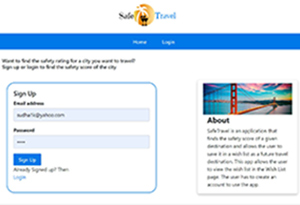

## Project Name: SafeTravel

 

## Table of Contents

<!-- vscode-markdown-toc -->
* 1. [Link repository](#Linktorepository)
* 2. [Introduction](#Introduction)
* 3. [Technologies](#Technologies)
* 4. [Files](#Files)
* 5. [Features](#Features)
* 6. [Future Development](#FutureDeveloment)
* 7. [Launch](#Launch)

<!-- vscode-markdown-toc-config
	numbering=true
	autoSave=true
	/vscode-markdown-toc-config -->
<!-- /vscode-markdown-toc -->

##  1. Link to repository

* [Repository](https://github.com/sskumar4/safetravel)
* [Link to deployment](https://safe-travel-wishlist.herokuapp.com/)
  
##  2. Introduction   

SafeTravel is an application that finds the safety score of a given destination using Amadeus API and allows the user to save the destination in a wish list as a future travel destination. After logging in, when the user selects a city, the safety score is displayed in a box on the same page. The user can click the 'Add to wish list' button which allows the user to save the destination and view the wish list in the Wish List page.

'SafeTravel' is a full stack app that the front-end and back-end interact with each other. The Front End takes user input using javascript and html/handlebars and queries the back-end. The back-end processes the API routes, makes queries to Amadeus/Google geocode API and sends back the JSON results. The back-end also implements html routes, when invoked from front-end queries the database and renders the page with saved list using handlebars. The front-end and back-end also has functionality that implements passport based user signup/login using mysql and sequelize that came with the starter files.

The starter model had user authentication information modeled using user.js. It was augmented with city safety score information using city.js

##  3. Technologies 
Express, handlebars, sequelize, mysql, nodejs, jquery, javascript, html HTML, CSS, BootStrap CSS, Pure CSS Heroku 

API: Amadeus API to get safety score and Google geocode API to get the lat, long of the city

NPM packages -- Express, express-handlebars, mysql

##  4. Files

js files:
 * Created city.js (back-end), wishlist.js (Front-end)
 * modified api-routes.js, html-routes.js (back-end)
Other files:
* style.css, main.handlebars, login.handlebars, members.handlebars, signup.handlebars, city-block.handlebars, wishlist.handlebars (front-end)

##  5. Features

### App Setup
 Create a GitHub repo and clone it to your computer.
 Make a package.json file by running npm init from the command line.
 Install the Express npm package: npm install express.
 Create a server.js file.
 Install the Handlebars npm package: npm install express-handlebars.
 Install the body-parser npm package: npm install body-parser.
 Install MySQL npm package: npm install mysql.
 Require the following npm packages inside of the server.js file: 
 express
 express-session

In this application, html templates are used using handlebars. Also used the MVC paradigm of project management to structure both out file setup, and the content of our script files.

## 6. Future Development
As a future development,
  1.  The app will allow the wish list destination to be marked as visited and add a travelogue about the destination which will be stored in a database or deleted from the list.
  2.  The app will be able to find and save sightseeing attractions around the safe destination.

## 7. Launch

* Deployed Heroku link to the app: https://safe-travel-wishlist.herokuapp.com/
